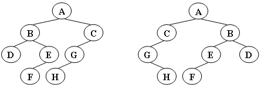
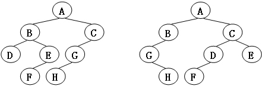

# 6-1 中序线索化二叉树及遍历

## 函数接口定义：
```
void InThreading(BiThrTree p);// 以结点P为根的子树中序线索化
void InOrderTraverse_Thr(BiThrTree T);// 中序遍历二叉线索树T的非递归算法，对每个数据元素直接输出
```
## 裁判测试程序样例：
```cpp
#include<iostream>
using namespace std;

typedef struct BiThrNode
{                
    char data;                        
    struct BiThrNode *lchild,*rchild;
    int LTag,RTag;
}BiThrNode,*BiThrTree;


BiThrNode *pre=new BiThrNode;

void CreateBiTree(BiThrTree &T)
{    
    char ch;
    cin >> ch;
    if(ch=='#')  T=NULL;            
    else
    {                            
        T=new BiThrNode;
        T->data=ch;                    
        CreateBiTree(T->lchild);
        CreateBiTree(T->rchild);    
    }                                
}                                

void InThreading(BiThrTree p);
void InOrderTraverse_Thr(BiThrTree T);

int main()
{
    pre->RTag=1;
    pre->rchild=NULL;
    BiThrTree tree;
    CreateBiTree(tree);
    InThreading(tree);
    InOrderTraverse_Thr(tree);
    return 0;
}
/* 请在这里填写答案 */
```
## 样例
```
ABD###CEG###FH##I##
```
```
DBAGECHFI
```


---

# 7-1 树的同构
给定两棵树 `T1`和`T2` 。如果 `T1` 可以通过若干次左右孩子互换就变成 `T2`，则我们称两棵树是“同构”的。例如`图1`给出的两棵树就是同构的，因为我们把其中一棵树的结点`A`、`B`、`G`的左右孩子互换后，就得到另外一棵树。而`图2`就不是同构的。

图1


图2


现给定两棵树，请你判断它们是否是同构的。

## 格式

### 输入
给出2棵二叉树的信息。对于每棵树，首先在一行中给出一个非负整数 n (≤10)，即该树的结点数（此时假设结点从 0 到 n−1 编号）；随后 n 行，第 i 行对应编号第 i 个结点，给出该结点中存储的 1 个英文大写字母、其左孩子结点的编号、右孩子结点的编号。如果孩子结点为空，则在相应位置上给出 “-”。给出的数据间用一个空格分隔。注意：题目保证每个结点中存储的字母是不同的。

### 输出
如果两棵树是同构的，输出“Yes”，否则输出“No”。

### 样例1

```
8
A 1 2
B 3 4
C 5 -
D - -
E 6 -
G 7 -
F - -
H - -
8
G - 4
B 7 6
F - -
A 5 1
H - -
C 0 -
D - -
E 2 -

```
```
Yes
```
### 样例2（对应图2）：

```
8
B 5 7
F - -
A 0 3
C 6 -
H - -
D - -
G 4 -
E 1 -
8
D 6 -
B 5 -
E - -
H - -
C 0 2
G - 3
F - -
A 1 4

```
```
No
```

0
0

