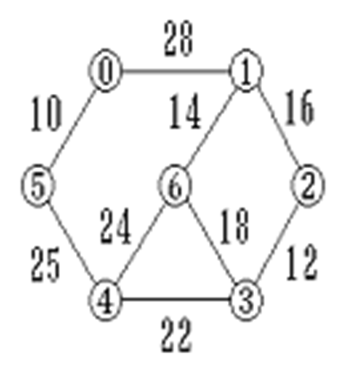

# 6-1 求采用邻接矩阵作为存储结构的有向图各顶点的入度

本题要求实现一个函数，输出有向图每个顶点的数据元素的值，以及每个顶点的入度的值。
## 函数接口定义
```cpp
void indegree(MGraph G);
```
G为采用邻接矩阵作为存储结构的有向图。

## 裁判测试程序
```cpp
#include <stdio.h>
#define MVNum 100                 //最大顶点数 
typedef struct{ 
  char vexs[MVNum];           //存放顶点的一维数组 
  int arcs[MVNum][MVNum];     //邻接矩阵 
  int vexnum,arcnum;          //图的当前顶点数和弧数 
}MGraph; 
void indegree(MGraph G);
void CreatMGraph(MGraph *G);/* 创建图 */
int main()
{
    MGraph G;
    CreatMGraph(&G);
    indegree(G);
    return 0;
}
void CreatMGraph(MGraph *G)
{
    int i,j,k;
    scanf("%d%d",&G->vexnum,&G->arcnum);
    getchar();
    for(i=0;i<G->vexnum;i++)
       scanf("%c",&G->vexs[i]);
    for(i=0;i<G->vexnum;i++)
       for(j=0;j<G->vexnum;j++)
           G->arcs[i][j]=0;
    for(k=0;k<G->arcnum;k++)
    {  
      scanf("%d%d",&i,&j);     
      G->arcs[i][j]=1;    
    }
}

/* 请在这里填写答案 */
```
## 样例

例如有向图


第一行给出图的顶点数n和弧数e。第二行给出n个字符，表示n个顶点的数据元素的值。后面是e行，给出每一条弧的两个顶点编号。
```input
4 5
ABCD
1 0
2 0
2 1
3 2
3 1
```

输出n个顶点的元素值，顶点的数据类型为字符型。以及各顶点的入度值
```
A:2
B:2
C:1
D:0
```

# 6-2 求采用邻接矩阵作为存储结构的无向图各顶点的度

本题要求实现一个函数，输出无向图每个顶点的数据元素的值，以及每个顶点度的值。
## 函数接口定义：
```c
void degree(MGraph G);
```
G为采用邻接矩阵作为存储结构的无向图。

裁判测试程序样例：
```c
#include <stdio.h>
#define MVNum 100                 //最大顶点数 
typedef struct{ 
  char vexs[MVNum];           //存放顶点的一维数组 
  int arcs[MVNum][MVNum];     //邻接矩阵 
  int vexnum,arcnum;          //图的当前顶点数和边数 
}MGraph; 
void degree(MGraph G);
void CreatMGraph(MGraph *G);/* 创建图 */
int main()
{
    MGraph G;
    CreatMGraph(&G);
    degree(G);
    return 0;
}
void CreatMGraph(MGraph *G)
{
    int i,j,k;
    scanf("%d%d",&G->vexnum,&G->arcnum);
    getchar();
    for(i=0;i<G->vexnum;i++)
       scanf("%c",&G->vexs[i]);
    for(i=0;i<G->vexnum;i++)
       for(j=0;j<G->vexnum;j++)
            G->arcs[i][j]=0;
    for(k=0;k<G->arcnum;k++)
    {  
       scanf("%d%d",&i,&j);     
       G->arcs[i][j]=1; 
       G->arcs[j][i]=1; 
    }
}

/* 请在这里填写答案 */
```
## 样例

例如无向图


第一行给出图的顶点数`n`和边数`e`。第二行给出`n`个字符，表示`n`个顶点的数据元素的值。后面是`e`行，给出每一条边的两个顶点编号。
```in
4 5
ABCD
0 1
0 2
1 2
1 3
2 3
```
输出样例：

输出`n`个顶点的元素值，顶点的数据类型为字符型。以及各顶点的度值
```out
A:2
B:3
C:3
D:2
```

# 6-3 采用邻接表创建无向图

采用邻接表创建无向图G ，依次输出各顶点的度。
函数接口定义：
```c
void CreateUDG(ALGraph &G);
```
其中 G 是采用邻接表表示的无向图。

## 裁判测试程序样例
```c
#include <stdio.h>
#include <stdlib.h>
#define MVNum 100 
typedef struct ArcNode{
    int adjvex; 
    struct ArcNode *nextarc; 
    int info; 
}ArcNode; 

typedef struct VNode{ 
    char data; 
    ArcNode *firstarc; 
}VNode, AdjList[MVNum]; 

typedef struct{ 
    VNode vertices[MVNum]; 
    int vexnum, arcnum; 
}ALGraph;

void CreateUDG(ALGraph &G);

int main(){
    ALGraph G;     
    int i , j,sum=0;
    CreateUDG(G);
    ArcNode * p; 
    for(i = 0 ; i < G.vexnum ; ++i){
        sum=0;
        p=G.vertices[i].firstarc;
        for(; p!=NULL; p=p->nextarc){
                sum+=1;
        }
        if(i==0)
            printf("%d",sum);
        else
            printf(" %d",sum);
    }
    return 0;
}

/* 请在这里填写答案 */
```
## 输入格式

输入第一行中给出2个整数i(0<i≤10)，j(j≥0)，分别为图G的顶点数和边数。
输入第二行为顶点的信息，每个顶点只能用一个字符表示。
依次输入j行，每行输入一条边依附的顶点。

## 输出格式:

依次输出各顶点的度，行末没有最后的空格。

## 样例
```in
5 7
ABCDE
AB
AD
BC
BE
CD
CE
DE
```
```out
2 3 3 3 3
```

# 6-4 采用邻接矩阵表示法创建无向图

采用邻接矩阵表示法创建无向图G ，依次输出各顶点的度。
## 函数接口定义
```c
void CreateUDN(AMGraph &G);
```
其中 G 是采用邻接矩阵表示的无向图。 

## 裁判测试程序样例
```c
#include <stdio.h>
#define MVNum 100                           
typedef struct{ 
    char vexs[MVNum];          
    int arcs[MVNum][MVNum];   
    int vexnum,arcnum;      
}AMGraph;

void CreateUDN(AMGraph &G);
int main(){
    AMGraph G;     
    int i , j,sum=0;
    CreateUDN(G);
    for(i = 0 ; i < G.vexnum ; ++i){
        sum=0;
        for(j = 0; j < G.vexnum; ++j){
            if(G.arcs[i][j]==1)
                sum+=1;
        }
        if(i==0)
            printf("%d",sum);
        else
            printf(" %d",sum);
    }
    return 0;
}

/* 请在这里填写答案 */
```
## 输入格式

输入第一行中给出2个整数`i`(0<`i`≤10)，`j`(`j`≥0)，分别为图G的顶点数和边数。
输入第二行为顶点的信息，每个顶点只能用一个字符表示。
依次输入j行，每行输入一条边依附的顶点。

## 输出格式:

依次输出各顶点的度，行末没有最后的空格。

## 样例
```in
5 7
ABCDE
AB
AD
BC
BE
CD
CE
DE
```
```
2 3 3 3 3
```

# 6-5 最小生成树（普里姆算法）

试实现普里姆最小生成树算法。
## 函数接口定义：
```cpp
void Prim(AMGraph G, char u);
```
其中 G 是基于邻接矩阵存储表示的无向图，u表示起点

## 裁判测试程序样例：
```cpp
#include <iostream>
#define MVNum 10
#define MaxInt 32767 
using namespace std;

struct edge{
    char adjvex;
    int lowcost;
}closedge[MVNum];

typedef struct{ 
    char vexs[MVNum];   
    int arcs[MVNum][MVNum]; 
    int vexnum,arcnum;
}AMGraph;
int LocateVex(AMGraph G , char v);//实现细节隐藏
int Min(AMGraph G);//实现细节隐藏
int CreateUDN(AMGraph &G);//实现细节隐藏

void Prim(AMGraph G, char u);

int main(){
    AMGraph G;
    CreateUDN(G);
    char u;
    cin >> u;
    Prim(G , u);
    return 0;
}
```
## 样例

第1行输入结点数vexnum和边数arcnum。第2行输入vexnum个字符表示结点的值，接下来依次输入arcnum行，每行输入3个值，前两个字符表示结点，后一个数表示两个结点之间边的权值。最后一行输入一个字符表示最小生成树的起始结点。
```
7 9
0123456
0 1 28
0 5 10
1 2 16
1 6 14
2 3 12
3 6 18
3 4 22
4 5 25
4 6 24
0
```

按最小生成树的生成顺序输出每条边。
```
0->5
5->4
4->3
3->2
2->1
1->6
```


